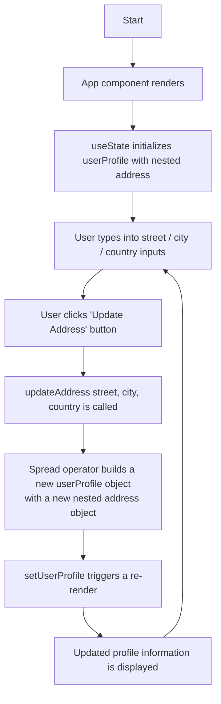

# User Profile with Nested State

A small React + Vite project built for a classroom assignment that
demonstrates how to manage and update a **nested state object** in React
using `useState` and the spread operator.

---

## Overview

This app renders a single user profile card. The profile is stored in
component state as a nested object that contains a `name`, an `email`, and a
nested `address` object (`street`, `city`, `country`).

The user can type a new street, city, and country into a small form and click
**Update Address**. When that happens, only the `address` field is replaced —
the rest of the profile stays exactly the same — and the UI re-renders with
the updated information.

## Objective

Practice the core React concept of **immutable state updates** for nested
objects. Instead of mutating the existing state, we build brand new objects
with the spread operator (`...`) so React can detect the change and re-render
correctly.

## Features

- React functional component using the `useState` hook
- Nested state object (`userProfile.address`)
- Controlled inputs for street, city, and country
- `updateAddress(street, city, country)` helper that updates state immutably
- Live display of the current profile, including the nested address
- Clean, modern, responsive card UI

## Tech Stack

- [React 18](https://react.dev/)
- [Vite 5](https://vitejs.dev/)
- Plain CSS (no UI library required)
- JavaScript (`.jsx`)

---

## Installation

> Requires Node.js 18 or newer.

```bash
# 1. Clone the repository
git clone https://github.com/<your-username>/react-user-profile-app.git
cd react-user-profile-app

# 2. Install dependencies
npm install
```

## Run Instructions

```bash
# Start the development server
npm run dev
```

Vite will print a local URL (usually <http://localhost:5173>). Open it in your
browser to use the app.

Other useful scripts:

```bash
npm run build     # Production build into ./dist
npm run preview   # Preview the production build locally
```

---

## File Structure

```
react-user-profile-app/
├── index.html              # Vite HTML entry point
├── package.json            # Project metadata & scripts
├── vite.config.js          # Vite + React plugin config
├── README.md               # You are here
└── src/
    ├── main.jsx            # React entry point (mounts <App />)
    ├── App.jsx             # Top-level layout & page chrome
    ├── UserProfile.jsx     # The assignment component (nested state demo)
    └── index.css           # Global styles for the card UI
```

---

## Explanation: Immutable Nested Updates

In React you should **never mutate state directly**. If you do, React may not
notice the change and the UI won't update. For nested objects this is a little
trickier, because copying only the outer object isn't enough — you also have
to copy each nested object you want to change.

Here is the helper used in `src/UserProfile.jsx`:

```jsx
const updateAddress = (street, city, country) => {
  setUserProfile((prev) => ({
    ...prev,            // 1. copy the top-level fields (name, email, ...)
    address: {
      ...prev.address,  // 2. copy the existing address fields
      street,           // 3. overwrite just the ones we want to change
      city,
      country,
    },
  }))
}
```

Step by step:

1. `...prev` creates a brand new top-level object that still contains
   `name` and `email`.
2. `address: { ...prev.address, ... }` creates a brand new `address` object
   so React sees a different reference and triggers a re-render.
3. The new `street`, `city`, and `country` values overwrite the previous
   address fields, while any other address fields (if you added more later)
   would be preserved.

The original `userProfile` object in memory is **never modified** — we always
hand React a fresh object. That is what "immutable update" means.

---

## Flowchart



---

## Submission Guidance

Before turning in the assignment:

1. Run the app locally (`npm run dev`) and confirm that:
   - The initial profile is shown.
   - Typing into the inputs and clicking **Update Address** updates the
     "Current Address" section above the form.
   - The `name` and `email` fields stay the same after an update.
2. Make sure your code is saved and the dev server runs without errors.
3. Commit your work and push to your GitHub repo:
   ```bash
   git add .
   git commit -m "Initial commit: User Profile with nested state assignment"
   git push -u origin main
   ```
4. Submit the GitHub repository link (and optionally a screenshot of the
   running app) on your class portal.
5. Be ready to explain in class:
   - What `useState` does.
   - Why we use the spread operator to update nested state.
   - What would happen if we mutated `userProfile.address.city` directly
     instead of creating a new object.

Good luck!
